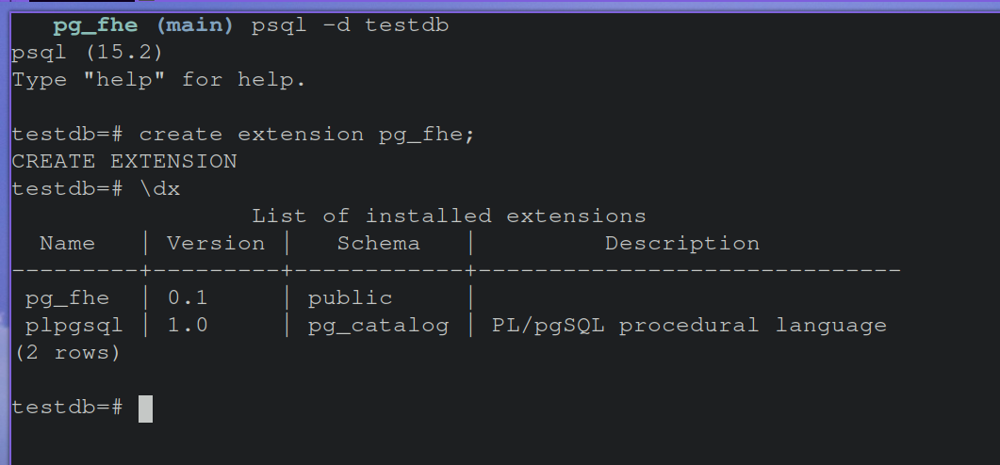

# PostgreSQL Fully Homomorphic Encryption
## Purpose
Fully Homomorphic Encryption (FHE) is a powerful new type of encryption that allows for computing on encrypted data.
Libraries such as Microsoft SEAL have created a way for developers to leveragre FHE in their applications. 
The goal of this project is to bring SEAL into PostgreSQL so that the benefits of FHE can be leveraged directly through raw SQL. 
## Building, Installing, Running
To build and Install the extension, navigate to the ```pg_fhe``` folder. In there you will find a shell script ```install.sh``` which builds the extension using cmake, and installs the build files to PostgreSQL. This assumes that you have cmake and PostgreSQL already installed on you system. 

To run the extension from PostgreSQL, enter your Postgres shell and run: ```create extension pg_fhe```. You will then be able to use the extension within your database.

## Performance Tests

