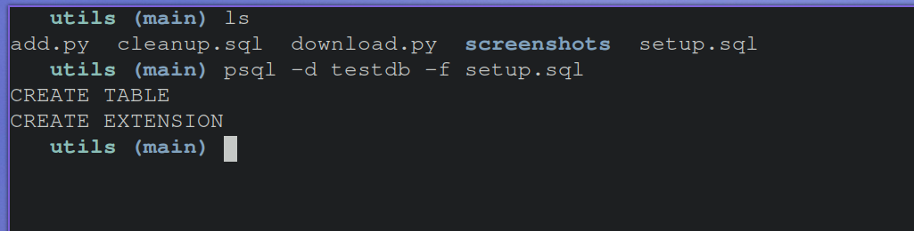
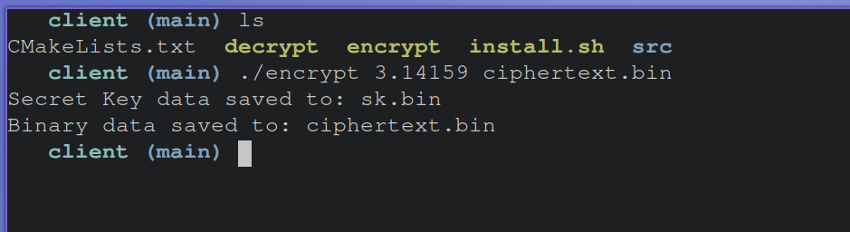
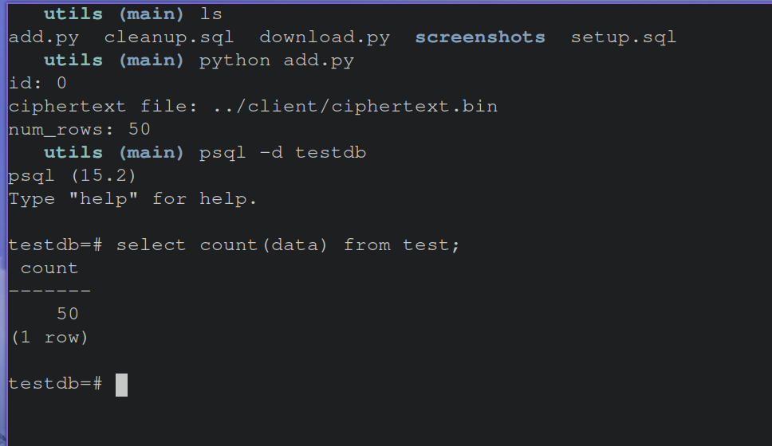
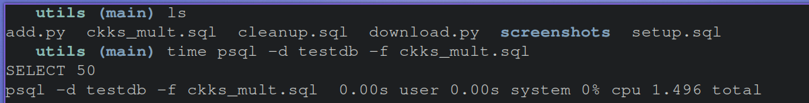
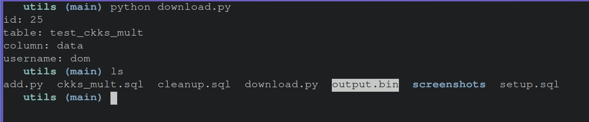
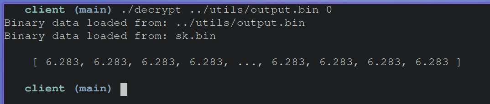

# PostgreSQL Fully Homomorphic Encryption
## Purpose
Fully Homomorphic Encryption (FHE) is a powerful new type of encryption that allows for computing on encrypted data.
Libraries such as Microsoft SEAL have created a way for developers to leveragre FHE in their applications. 
The goal of this project is to bring SEAL into PostgreSQL so that the benefits of FHE can be leveraged directly through raw SQL. 
## Building, Installing, Running
To build and Install the extension, navigate to the ```pg_fhe``` folder. In there you will find a shell script ```install.sh``` which builds the extension using cmake, and installs the build files to PostgreSQL. This assumes that you have cmake and PostgreSQL already installed on you system. 

To run the extension from PostgreSQL, enter your Postgres shell and run: ```create extension pg_fhe```. You will then be able to use the extension within your database.

## Tests & Examples
In the ```utils/``` and ```client/``` directories we have provided some helpful tools that we can use to create a working example.

### Setup
To start, we can run ```utils/setup.sql``` which runs the following sql code:
```sql
CREATE table test (
    id SERIAL PRIMARY KEY,
    data bytea
);

CREATE EXTENSION pg_fhe;
```


### Encryption
Next we can encrypt some data. The encryption used in the extension uses the CKKS scheme, with encryption parameters selected using Microsoft SEAL's recomendations, for operations on floating point numbers. Keep in mind that CKKS gives approximate results. The level of accuracy will depend on the size of your input. For this example we will use the first few digits of pi as our input. As shown below, run the ```client/encrypt``` binary to encrypt your input. For the arguments, supply the floating point number which you want to encrypt and the output binary file which will store your ciphertext.

The encryption binary will also output a binary file ```sk.bin``` which stores the secret key which is needed for decryption.

### Inserting Ciphertexts into the table
We provide a tool ```utils/add.py``` which will insert ciphertext binaries into the table which we created earlier. To run it using python, choose a starting id, the path to your ciphertext, and how many rows you would like to create. You may be prompted to enter your username which you used to connect to the database. To simulate a small dataset, we will chose 50 rows. We will choose larger values later to benchmark the performance of the tool. It is also worth noting that we are copying the same ciphertext into 50 rows. In a real-world scenario there would be different ciphertexts, but for the purposes of this example and benchmarking the tool we will use the same ciphertext for multiple rows.


### Testing ckks\_mult
Now that we have our ciphertexts in the database, we can test the pg_fhe extension. We will specifically be testing the ckks_mult() function, which takes ckks encrypted data, and multiplies the data by 2.0. So when we decrypt, we should expect the result to be our input multiplied by 2.0. 

While this may seem to be a trivial example, it shows how we can compute on encrypted data. In the future we plan to release more complex operations. As a result of combining operations, more complex computational logic can be achieved. 

To run the function we have provided a sql script, which runs the following sql code:
```sql
CREATE TABLE test_ckks_mult as 
    SELECT id, ckks_mult(data) as data FROM test;
```

As you can see, operating on 50 rows of data, the operations took a little over 1 second, which is reasonable. Later we will benchmark the function on larger datasets, to test if the tool can scale, and the limitations of FHE.

### Downloading Computed Ciphertexts
Now that we have a new table containing our computed ciphertexts, we can download them and decrypt them using the secret key that we made earlier. Keep in mind that at no point did our server have any access to the secret key. The server can compute meaningful results without leaking any information about the plaintext. This is the magic of FHE.

To download the ciphertext binaries from the table we have provided a tool ```utils/download.py```. Since we have 50 ciphertexts coresponding to the same input, we only have to download and decrypt one of them. To download follow as shown below. Please substitute my username for your username which you used to log into the database:


This will produce an output binary in the ```utils/``` directory, ```output.bin```.
### Decrypting
Finally we can use the decrypt binary from ```client/decrypt``` to decrypt our output. Run the binary as shown below. Arguments passed to the binary are the "ciphertext" which in our case is the ```output.bin``` which we generated in the previous step, and a bit (0 || 1). If you are decrypting a ciphertext which was computed on, set this bit to 0, this is our case. If you are decrypting a fresh ciphertext, this bit can be set to 1. This might feel tedious and we are working on changing this design. 



Finally we can see that we get our desired output! You will see that the output is duplicted, this is by design of ckks, but our output is correct, we get pi*2.0.
